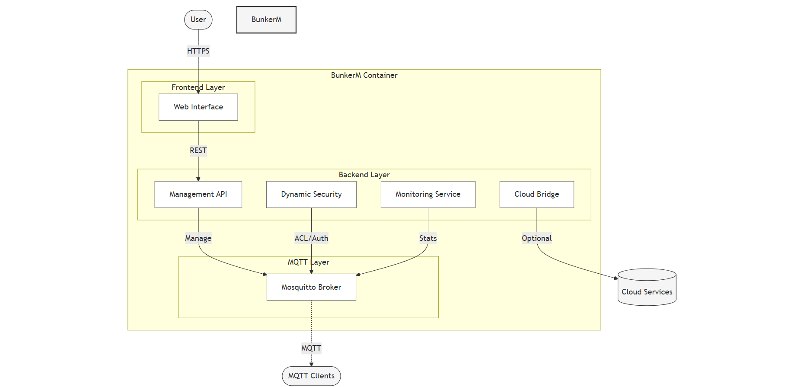
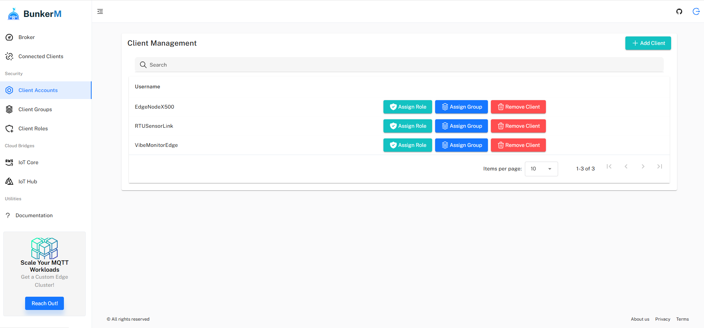
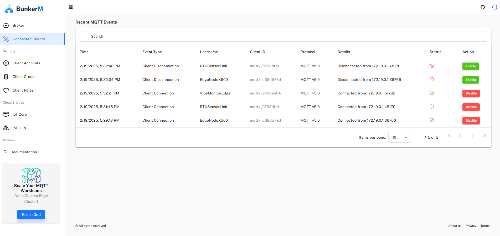

# BunkerM - MQTT Broker Management Suite

<p align="center">
  
</p>

BunkerM is an open-source, containerized MQTT management solution that bundles together a Mosquitto broker with a comprehensive web interface. It provides a complete, ready-to-deploy MQTT environment with built-in management capabilities, eliminating the need for separate broker setup and configuration.


This all-in-one solution features dynamic security controls, real-time monitoring, client activity logging, and cloud integration capabilities. The entire stack - Mosquitto broker, backend services, and frontend UI - comes pre-configured in Docker containers for easy deployment and management.

> **License**: Free for non-commercial use  
> **Website**: https://bunkeriot.com

## Core Components
* Mosquitto MQTT Broker (pre-configured)
* Backend Management Services
* Web-based Management Interface
* Dynamic Security Module
* Monitoring and Logging System
* Cloud Bridge Integration (Pro Feature)


## Quick Start

1. Clone the repository and navigate to the project directory:
```bash
git clone [repository-url]
cd [repository-name]
```

2. Launch the application:
```bash
docker compose up --build
```

3. Access the interface:
   - Open your browser and navigate to `https://localhost:2000`
   - You'll see a security warning about the SSL certificate
   
   - Click "Advanced" and then "Proceed to localhost (unsafe)"
   - This warning is normal and appears because we use a self-signed certificate for development

## Core Features

### 1. Broker Dashboard
Monitor and control MQTT client connections in real-time through the "Recent MQTT Events" dashboard:
- Connected clients count
- Message statistics
- Byte transfer rates
- Subscription tracking
- Retained message counts


### 2. Dynamic Security Module
Manage your MQTT broker's clients:



- **Client Management**
  - Create new MQTT clients
  - Set client credentials
  - Manage client permissions
  - Group assignments

- **Role Management**
  - Create and configure roles
  - Set up ACL rules
  - Define topic permissions
  - Manage access patterns

- **Group Management**
  - Create client groups
  - Assign roles to groups
  - Manage group members
  - Set priorities


### 3. Cloud Integration (Pro Feature)
Connect to major cloud providers:

- **AWS IoT Core Bridge**
  - AWS IoT endpoint configuration
  - Certificate management
  - Topic mapping
  - Secure communication

- **Azure IoT Hub Bridge**
  - IoT Hub connection setup
  - Device authentication
  - SAS token management
  - Topic routing

## MQTT Clients Administration

1. **Access the Logging Interface**
   - Navigate to "Recent MQTT Events"
   - View real-time client activities
   - Monitor connection status

2. **Control Client Connections**
   - For active clients:
     - Click "Disable" to terminate connection
     - Instant effect on client access
     - Status updates to disconnected
   
   - For disabled clients:
     - Click "Enable" to restore access
     - Client can reconnect immediately
     - Status updates when client connects


3. **Search and Filter**
   - Use search bar for specific clients
   - Filter by connection status
   - Track specific client activities
   - Monitor multiple clients


## Troubleshooting

- Verify Docker is running
- Check port availability (2000)
- Monitor Docker logs
- Verify network connectivity
- Check SSL certificate configuration

## Support & Custom Devevelopment

For issues or questions:
* Visit our website: https://bunkeriot.com
* Check documentation (Coming soon)
* Contact me :  
 [](https://www.linkedin.com/in/mehdi-idrissi/)


## Features


### Infrastructure & Scaling
| Feature | Community | Pro | Enterprise |
|---------|:---------:|:---:|:----------:|
| Max Clients | Unlimited | Unlimited | Unlimited |
| High Availability & Clustering | ✗ | ✗ | ✓ |
| Clustering for High Availability | ✗ | ✗ | ✓ |
| Cluster Management UI | ✗ | ✗ | ✓ |
| Load Balancer | ✗ | ✗ | ✓ |
| Cluster Management REST API | ✗ | ✓ | ✓ |
| Enhanced HA Monitoring | ✗ | ✗ | ✓ |

### Core Management
| Feature | Community | Pro | Enterprise |
|---------|:---------:|:---:|:----------:|
| Dynamic Security | ✓ | ✓ | ✓ |
| BunkerM Cluster Cloud Management | ✗ | ✗ | ✓ |
| Multiple Connected Brokers | ✓ | ✓ | ✓ |
| Edge Management UI | ✓ | ✓ | ✓ |

### Security Features
| Feature | Community | Pro | Enterprise |
|---------|:---------:|:---:|:----------:|
| Client Authentication (ID+Password) | ✓ | ✓ | ✓ |
| Client Certificate Authentication | ✗ | ✗ | ✓ |
| Self-Signed SSL | ✓ | ✓ | ✓ |
| PSK Authentication | ✗ | ✗ | On-demand |
| Dynamic Security Plugin | ✓ | ✓ | ✓ |
| ACLs (Client, Role, Group Levels) | ✓ | ✓ | ✓ |
| Anonymous Client Access | ✗ | ✓ | ✓ |
| Custom CAs | ✗ | ✗ | On-demand |
| HTTPS/TLS Termination | ✗ | ✗ | ✓ |
| Audit Trail | ✗ | ✗ | On-demand |
| OAuth 2.0 / JWT Authentication | ✓ | ✓ | ✓ |
| LDAP Authentication | ✗ | ✗ | ✓ |

### Cloud & Database Integrations
| Feature | Community | Pro | Enterprise |
|---------|:---------:|:---:|:----------:|
| Azure IoT Hub | ✗ | ✓ | ✓ |
| AWS IoT Core | ✗ | ✓ | ✓ |
| Kafka Bridge | ✗ | ✗ | On-demand |
| MongoDB/Atlas Bridge | ✗ | ✗ | On-demand |
| MySQL Bridge | ✗ | ✗ | On-demand |
| PostgreSQL Bridge | ✗ | ✗ | On-demand |
| MariaDB Bridge | ✗ | ✗ | On-demand |
| TimescaleDB Bridge | ✗ | ✗ | On-demand |
| Amazon Redshift Bridge | ✗ | ✗ | On-demand |
| CockroachDB Bridge | ✗ | ✗ | On-demand |
| MS SQL Server Bridge | ✗ | ✗ | On-demand |
| Oracle DB Bridge | ✗ | ✗ | On-demand |
| Snowflake Bridge | ✗ | ✗ | On-demand |
| InfluxDB Metrics Exporter | ✗ | ✗ | On-demand |
| Prometheus Metrics Exporter | ✗ | ✗ | On-demand |

### Monitoring & User Management
| Feature | Community | Pro | Enterprise |
|---------|:---------:|:---:|:----------:|
| Broker Insights | ✓ | ✓ | ✓ |
| Connected Clients Listing | ✓ | ✓ | ✓ |
| Broker Status | ✗ | ✓ | ✓ |
| User Authentication | ✓ | ✓ | ✓ |
| Unlimited Users | ✗ | ✗ | ✓ |
| User Roles & RBAC | ✗ | ✗ | ✓ |
| Single Sign-On (SSO) | ✗ | ✗ | ✓ |
| REST APIs | ✗ | ✗ | ✓ |
| Application Tokens | ✓ | ✓ | ✓ |
| Client Control | ✓ | ✓ | ✓ |

### Protocol Support
| Feature | Community | Pro | Enterprise |
|---------|:---------:|:---:|:----------:|
| MQTT V3.1.1 | ✓ | ✓ | ✓ |
| MQTT V5 | ✓ | ✓ | ✓ |
| MQTT over TLS (MQTTS) | ✓ | ✓ | ✓ |
| WebSockets (WS) | ✓ | ✓ | ✓ |
| WebSockets over TLS (WSS) | ✓ | ✓ | ✓ |
| Sparkplug | ✓ | ✓ | ✓ |
| Sparkplug Decoding | ✓ | ✓ | ✓ |

### MQTT Features
| Feature | Community | Pro | Enterprise |
|---------|:---------:|:---:|:----------:|
| Quality of Service (QoS) Levels | ✓ | ✓ | ✓ |
| Last Will Messages | ✓ | ✓ | ✓ |
| Retained Messages | ✓ | ✓ | ✓ |
| Persistent Connections | ✓ | ✓ | ✓ |
| Mount Points | ✓ | ✓ | ✓ |

### Platform Support
| Feature | Community | Pro | Enterprise |
|---------|:---------:|:---:|:----------:|
| Docker (Linux, Windows, macOS, RPi) | ✓ | ✓ | ✓ |
| RPM (RedHat, CentOS, Rocky Linux) | ✓ | ✓ | ✓ |
| Kubernetes | ✓ | ✓ | ✓ |
| OpenShift | ✓ | ✓ | ✓ |
| Windows | ✓ | ✓ | ✓ |
| White Labeling | ✗ | ✗ | ✓ |

