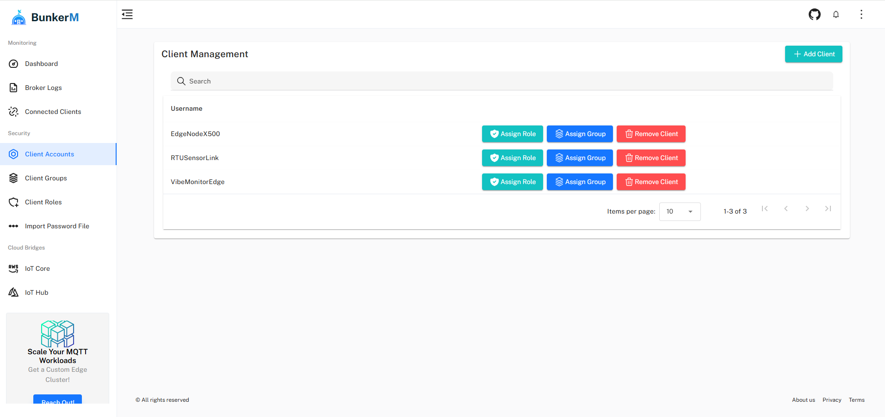

# Dynamic Security

BunkerM leverages Mosquitto's Dynamic Security Plugin to provide flexible, runtime-configurable access control for your MQTT broker. This powerful feature allows you to manage client authentication and authorization without restarting the broker.



## Understanding Dynamic Security

The Dynamic Security Plugin is an extension for Mosquitto that replaces the traditional static password and ACL file approach with a dynamic, JSON-based configuration system. BunkerM provides a user-friendly interface to manage this system.

Key benefits include:

- **Runtime Configuration**: Change security settings without broker restarts
- **Fine-grained Access Control**: Detailed control over who can access what
- **Hierarchical Structure**: Organize clients into groups with inherited permissions
- **Flexible Role System**: Define reusable permission sets
- **Import/Export Capability**: Easily backup or transfer configurations

## Dynamic Security Components

The dynamic security system in BunkerM consists of several key components:

### Clients

Clients represent MQTT client connections and contain:
- Username and password for authentication
- Optional group memberships
- Optional direct role assignments

### Roles

Roles define sets of permissions that can be assigned to clients or groups:
- Topic access rules (publish/subscribe permissions)
- Access control lists (ACLs)
- Priority levels for conflict resolution

### Groups

Groups organize clients and provide:
- Collective role assignments
- Hierarchical structure (groups can contain other groups)
- Simplified management for multiple clients

### ACLs

Access Control Lists define:
- Which topics a client can publish to
- Which topics a client can subscribe to
- Whether access is allowed or denied

## Import/Export ACL

BunkerM provides a dedicated interface for importing and exporting the dynamic security configuration:

### Exporting Configuration

To export your current dynamic security configuration:

1. Navigate to **MQTT Management** > **Import/export ACL**
2. In the "Export ACL" section, click **Export ACL**
3. The system will generate a JSON file containing all clients, roles, and groups
4. Save the file to your local system

This exported file can be used for:
- Backup purposes
- Transferring configuration between environments
- Version control of your security settings

### Importing Configuration

To import a dynamic security configuration:

1. Navigate to **MQTT Management** > **Import/export ACL**
2. In the "Import ACL" section, click the file input field
3. Select a valid dynamic security JSON file
4. Click **Import ACL**

The import process will add all clients, roles, and groups defined in the JSON file to your BunkerM instance.

!!! warning
    Importing a configuration will not remove existing entries. If you want to completely replace your configuration, consider resetting it first.

## Dynamic Security JSON Format

The dynamic security configuration uses a specific JSON format defined by the Mosquitto project. Here's a simplified example:

```json
{
  "clients": [
    {
      "username": "client1",
      "password": "hashedpassword",
      "clientid": "client_1",
      "groups": ["group1"],
      "roles": ["role1"]
    }
  ],
  "groups": [
    {
      "groupname": "group1",
      "roles": ["role2"]
    }
  ],
  "roles": [
    {
      "rolename": "role1",
      "acls": [
        {
          "acltype": "publishClientSend",
          "topic": "sensors/#",
          "allow": true
        }
      ]
    },
    {
      "rolename": "role2",
      "acls": [
        {
          "acltype": "subscribePattern",
          "topic": "commands/#",
          "allow": true
        }
      ]
    }
  ]
}
```

For the complete specification, refer to the [official Mosquitto documentation](https://github.com/eclipse-mosquitto/mosquitto/blob/master/test/broker/dynamic-security-init.json).

## Permission Evaluation

When a client attempts to publish to or subscribe to a topic, the dynamic security plugin evaluates permissions in the following order:

1. **Direct Client ACLs**: ACLs directly assigned to the client via roles
2. **Group ACLs**: ACLs inherited from groups the client belongs to
3. **Default Access**: If no matching ACL is found, access is denied

When multiple ACLs match a topic:

1. More specific topic patterns take precedence over more general ones
2. Deny rules take precedence over allow rules
3. Higher priority roles take precedence over lower priority roles

## Best Practices

### Security

- Follow the principle of least privilege
- Use specific topic patterns rather than broad wildcards
- Regularly audit your security configuration
- Back up your dynamic security configuration regularly

### Organization

- Create a logical group hierarchy
- Use descriptive names for roles and groups
- Document your security model
- Use roles for functional permissions, not individual clients

### Performance

- Keep your security configuration as simple as possible
- Avoid excessive nesting of groups
- Use specific topic patterns to improve ACL evaluation performance

## Related Documentation

- [Client Management](../mqtt/client-management.md) - Managing MQTT client accounts
- [Role Management](../mqtt/role-management.md) - Configuring access control roles
- [Group Management](../mqtt/group-management.md) - Organizing clients into groups
- [Password Management](password-management.md) - Managing client credentials 