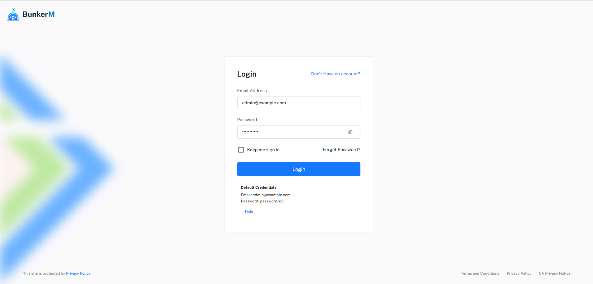

# First Login

This guide will walk you through the initial login process and the essential first steps to secure and configure your BunkerM installation.

## Accessing the Login Page

After installing BunkerM, you can access the web interface:

1. Open your web browser and navigate to `https://localhost:2000` (or the appropriate address if installed on a remote server)
2. You'll see a security warning about the SSL certificate (this is normal as BunkerM uses a self-signed certificate)
3. Click "Advanced" and then "Proceed to localhost (unsafe)"
4. You should now see the BunkerM login page

## Default Credentials

For your first login, use the following default credentials:

- **Username**: admin
- **Password**: admin

## Changing the Default Password

For security reasons, you should change the default password immediately after your first login:

1. After logging in, click on your username in the top-right corner
2. Select **Account Settings** from the dropdown menu
3. In the **Change Password** section, enter your current password and your new password twice
4. Click **Update Password**

!!! warning
    Using the default credentials in a production environment poses a significant security risk. Always change the default password immediately.

## Initial Dashboard Overview

After logging in, you'll be taken to the main dashboard, which provides an overview of your MQTT broker's status:

- **Connected Clients**: Shows the number of currently connected MQTT clients
- **Message Statistics**: Displays message throughput metrics
- **Broker Status**: Indicates whether the broker is running properly
- **Recent Activity**: Shows recent connection and message events

## Essential First-Time Setup Tasks

### 1. Configure Broker Settings

Before using BunkerM in production, you should review and adjust the broker configuration:

1. Navigate to **MQTT Management** > **Broker Configuration** in the left sidebar
2. Review the default settings and adjust them according to your needs
3. Pay special attention to:
   - Maximum connections
   - Maximum message size
   - Persistence settings
   - Logging levels
4. Click **Save Configuration** when done

### 2. Create Administrator Accounts

If multiple people will be managing the broker, create separate administrator accounts:

1. Navigate to **Administration** > **User Management**
2. Click **Add User**
3. Fill in the user details and select the appropriate role
4. Click **Save**

### 3. Set Up Your First MQTT Client

To test that everything is working correctly:

1. Navigate to **MQTT Management** > **Client Management**
2. Click **Add Client**
3. Enter a username and password for your test client
4. Click **Save**

### 4. Configure Access Control

BunkerM uses a role-based access control system for MQTT clients:

1. Navigate to **MQTT Management** > **Role Management**
2. Click **Add Role**
3. Create a basic role with appropriate permissions
4. Assign this role to your test client

## Next Steps

After completing the initial setup, you can:

- [Configure more detailed ACL rules](../mqtt/acl-configuration.md)
- [Set up client groups](../mqtt/group-management.md)
- [Explore monitoring capabilities](../monitoring/performance-metrics.md)
- [Configure cloud integrations](../cloud/aws-iot-core.md) (Pro feature)

For more detailed information on any of these topics, refer to the specific sections in this documentation. 