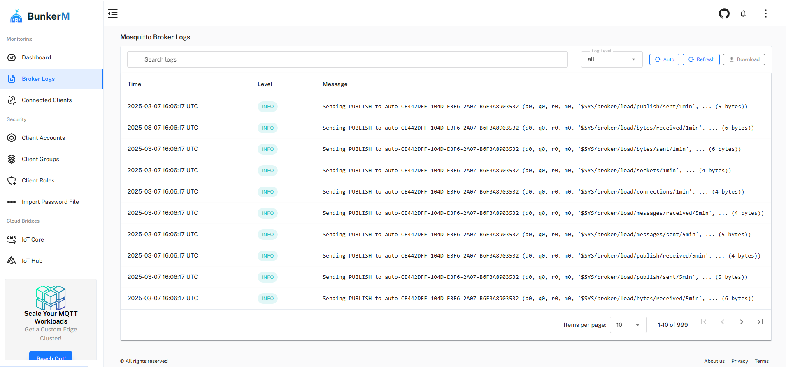

# Broker Logs

The Broker Logs interface in BunkerM provides detailed visibility into the Mosquitto MQTT broker's operation. These logs are essential for troubleshooting issues, monitoring broker health, and understanding client connection patterns.



## Understanding Broker Logs

Broker logs capture various events and activities within the Mosquitto MQTT broker, including:

- Client connections and disconnections
- Authentication successes and failures
- Subscription activities
- Configuration changes
- Error conditions
- Broker startup and shutdown events

These logs provide a chronological record of all significant events in the broker's operation.

## Log Interface Overview

The broker logs interface displays a table of log entries with the following information:

- **Timestamp**: When the log entry was recorded
- **Level**: The severity level of the log entry
- **Message**: The detailed log message
- **Source**: The component that generated the log entry

## Log Levels

BunkerM displays logs with different severity levels, each indicated by a distinct color:

- **Debug** (Gray): Detailed information useful for debugging
- **Info** (Blue): General information about normal operation
- **Notice** (Green): Important but normal events
- **Warning** (Orange): Potential issues that don't affect core functionality
- **Error** (Red): Serious problems that affect functionality
- **Critical** (Purple): Severe errors that may cause system instability

## Filtering Logs

To help you find relevant information quickly, the broker logs interface provides several filtering options:

### Time Range Filtering

Select logs from a specific time period:

- **Last hour**: Show only logs from the past hour
- **Last day**: Show only logs from the past 24 hours
- **Last week**: Show only logs from the past 7 days
- **Custom range**: Specify a custom date and time range

### Level Filtering

Filter logs by severity level:

- Select one or more log levels to display
- Deselect levels you want to hide

### Text Search

Search for specific text within log messages:

- Enter keywords in the search box
- The results will show only logs containing those keywords

## Exporting Logs

For record-keeping or external analysis, you can export broker logs:

1. Apply any desired filters to narrow down the logs
2. Click the **Export** button
3. Choose your preferred format (CSV or JSON)
4. Save the file to your local system

## Common Log Patterns

Understanding common log patterns can help you quickly identify issues:

### Normal Operation

```
1678901234: New client connected from 192.168.1.100 as client123 (c1, k60, u'client123').
1678901235: Client client123 disconnected.
```

These logs show normal client connection and disconnection events.

### Authentication Issues

```
1678901234: Client client456 disconnected due to protocol error.
1678901235: Client <unknown> disconnected, not authorized.
```

These logs indicate clients failing to authenticate properly.

### Configuration Problems

```
1678901234: Error: Unable to load certificate file.
1678901235: Warning: Maximum connections limit reached.
```

These logs point to configuration issues that need attention.

## Troubleshooting with Broker Logs

### Connection Issues

If clients can't connect to the broker:

1. Look for authentication errors in the logs
2. Check for "maximum connections" warnings
3. Verify that the broker is accepting connections on the expected port

### Performance Problems

If the broker is performing poorly:

1. Look for warnings about resource limits
2. Check for frequent client disconnections and reconnections
3. Monitor for unusual message patterns

### Security Concerns

To investigate potential security issues:

1. Look for repeated authentication failures from the same IP address
2. Check for unauthorized access attempts
3. Monitor for unusual connection patterns

## Log Retention

BunkerM retains broker logs according to the following policy:

- **Default retention**: 7 days
- **Maximum log size**: 1GB

When logs exceed these limits, older entries are automatically pruned.

## Related Documentation

- [Client Logs](client-logs.md) - For client-specific activity logs
- [Performance Metrics](performance-metrics.md) - For broker performance monitoring
- [Troubleshooting](../troubleshooting.md) - General troubleshooting guidance 